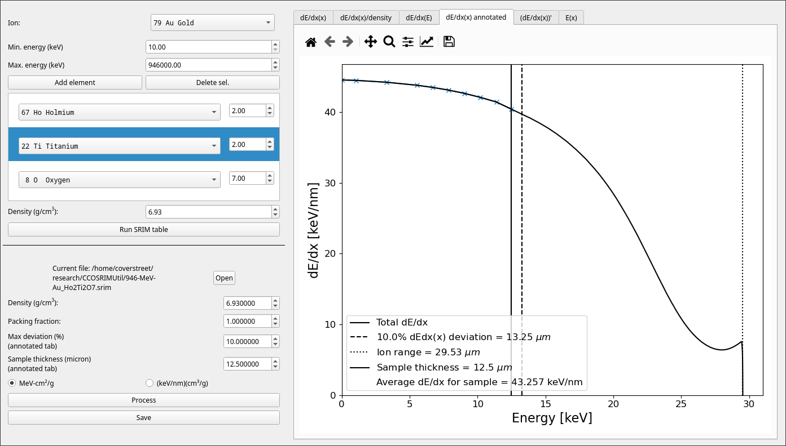

# CCO Srim Utility

This utility provides a python package and GUI for interfacing with SRIM and is used to convert the output of SRIM into an energy loss vs. depth format with sensible units. The GUI can post-process SRIM files with different packing fractions from already run SRIM results and directly run SRIM using the embedded SR Module.

## Installing

- Python
    - `python -m pip install srimutil_ccoverstreet`
    - Or in developer mode
        ```
        git clone https://github.com/ccoverstreet/CCOSRIMUtil
        cd CCOSRIMUtil
        python -m pip install -e .
        ```
- Download Windows executable

## Standalone GUI mode

- Python
    - `python -m srimutil_ccoverstreet`
- Or Windows executable
- SR Module setup known to work on Linux and Windows, unsure about Mac (would need wine)




